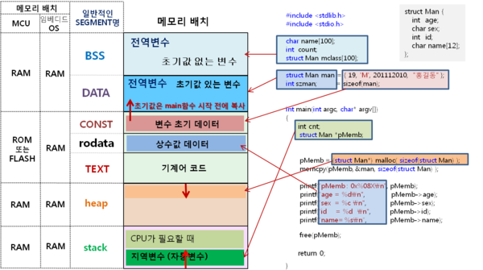

# 메모리
지역 변수는 **스택 영역**에 <br/>
정적, 전역 변수는 **DATA 영역**에 <br/>
동적 변수는 **힙 영역**에 메모리가 할당된다고 한다.

개발자 관점에서 알아야 할 부분은 스택과, 힙 영역이다. 그럼
**araboza**

## 메모리 구조
----------------
메모리는 대개 다음 영역으로 구분된다.
- 코드 영역 : 실행 가능한 코드가 저장되는 영역
- 데이터 영역 : 전역 변수와 정적 변수가 저장되는 영역 (BSS, DATA)
- 힙 영역 : 동적으로 할당된 메모리가 저장되는 영역
- 스택 영역 : 함수 호출과 지역 변수에 대한 메모리가 저장되는 영역


https://ko.wikipedia.org/wiki/%EB%8F%99%EC%A0%81_%EB%A9%94%EB%AA%A8%EB%A6%AC_%ED%95%A0%EB%8B%B9

## 스택 영역
----------
- LIFO(Last In, First Out) : 가장 최근에 할당된 메모리 블록이 가장 먼저 해제되는 방식을 사용한다. (윈도우 기준, 높은 메모리 주소에서 낮은 메모리 주소 방향으로 쌓인다.)
- 스택 영역에 할당된 메모리는 해당 변수가 범위를 벗어나거나 함수가 종료되면 자동으로 해제된다.
- 여기서 **스택 포인터**를 이용해 메모리를 할당하거나 해제한다.
- 스택 영역의 크기는 프로그램 시작 시 결정되며, 런타임 동안 변경되지 않는다. 따라서 스택에 너무 많은 메모리를 할당하면 **스택 오버플로우**가 발생할 수 있다.
```cpp 
#include <stdio.h>

void functionB() {
    int localVarB = 10; // 지역 변수 할당 (스택 영역)
    printf("Local variable in function B: %d\n", localVarB);
} // 함수 종료 시 localVarB 메모리가 해제된다

void functionA() {
    int localVarA = 5; // 지역 변수 할당 (스택 영역)
    printf("Local variable in function A: %d\n", localVarA);
    functionB(); // functionB 호출
} // 함수 종료 시 localVarA 메모리가 해제된다

int main() {
    functionA(); // functionA 호출
    return 0;
}

```

## 힙 영역
---------------
 - 힙 영역은 프로그램 실행 중 필요한 만큼 메모리를 동적으로 할당할 수 있다.( 요청된 크기에 맞는 충분한 연속 메모리 공간을 찾고, 이 과정에서 사용 가능한 메모리 블록들 중 적절한 공간을 찾아 할당)
 - 힙 영역에서 할당된 메모리는 개발자가 명시적으로 해제해야 한다. 하지 않으면 **메모리 누수**가 발생할 수 있다. 
 - 힙 영역의 메모리 할당은 **메모리 관리자(memory manager)**에 의해 관리된다. 메모리 관리자는 요청된 메모리 크기에 맞는 메모리 블록을 할당하고, 메모리 해제 요청을 처리한다.
 - 힙 영역에선 메모리를 반복적으로 할당하고 해제하면 메모리 단편화가 발생할 수 있다. (메모리 단편화는 사용 가능한 메모리 공간이 충분해도 요청된 크기의 연속된 메모리 블록을 찾지 못하는 현상이다.)
 - 메모리 할당 및 해제 속도는 스택 영역에 비해 상대적으로 느리다. 이는 메모리 관리자가 적절한 메모리 블록을 찾고 할당하는 과정에 시간이 소요되기 때문
  
```cpp
#include <iostream>

int main() {
    int *dynamicArray = nullptr;
    int size = 10;

    dynamicArray = new int[size]; // 동적 메모리 할당

    if (dynamicArray == nullptr) {
        std::cout << "Memory allocation failed." << std::endl;
        return 1;
    }

    for (int i = 0; i < size; i++) {
        dynamicArray[i] = i + 1;
    }

    for (int i = 0; i < size; i++) {
        std::cout << "dynamicArray[" << i << "] = " << dynamicArray[i] << std::endl;
    }

    delete[] dynamicArray; // 메모리 해제

    return 0;
}
```